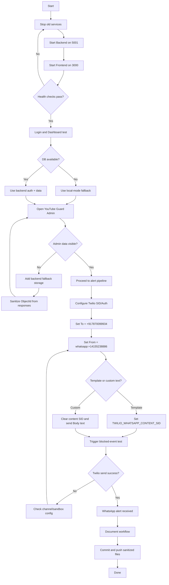

# MindHealix Workflow Summary

## Workflow Flowchart

## 1. Project Startup Workflow

### Goal
Run frontend and backend locally, verify both services, and confirm API health.

### Steps Used
1. Stop stale processes with `STOP_PROJECT.bat`.
2. Start backend on port 5001.
3. Start frontend on port 3000.
4. Verify:
   - Frontend HTTP: `http://localhost:3000`
   - Backend health: `http://localhost:5001/api/health`

### Verified Result
- Frontend: UP (HTTP 200)
- Backend: UP (Health 200)

---

## 2. Authentication + Dashboard Stability Workflow

### Issue Found
- Dashboard and Google login were unstable due to database connectivity issues.

### Fix Applied
1. Added local-mode safety fallback in frontend auth flow.
2. Improved Google credential decode robustness.
3. Enabled local-mode fallback behavior for smoother login/dashboard access when backend DB is unavailable.

### Outcome
- Login flow stabilized.
- Dashboard loads reliably in local mode.

---

## 3. YouTube Guard Admin Workflow

### Issue Found
- YouTube Guard Admin page showed no activity/events.

### Root Cause
- Activity was not always persisted when MongoDB writes failed.
- Response serialization error from ObjectId in fallback records.

### Fixes Applied
1. Added backend in-memory fallback storage for:
   - YouTube activity
   - Warning/block events
2. Removed non-serializable `_id` before JSON responses.
3. Updated frontend YouTube Guard API strategy:
   - Prefer backend data
   - Fall back to local data if backend/auth unavailable

### Outcome
- Admin page can show analyzed activity and events.
- Endpoints return valid responses even under DB instability.

---

## 4. Twilio WhatsApp Alert Workflow

### Initial Issue
- Twilio WhatsApp failed with channel mismatch errors.

### Actions Taken
1. Verified recipient format as international number.
2. Added improved Twilio error diagnostics in backend.
3. Implemented support for Twilio Content Template mode:
   - `TWILIO_WHATSAPP_CONTENT_SID`
4. Switched back to custom Body message mode when template text was not desired.
5. Corrected WhatsApp sender to sandbox sender:
   - `whatsapp:+14155238886`

### Final Verified Result
- Blocked-event alert API test succeeded.
- WhatsApp message sent successfully (`sent=true`, Twilio SID received).

---

## 5. Message Content Workflow

### Requirement
Use custom safety alert text instead of appointment template text.

### Final Behavior
Blocked-event alert now sends custom wording, for example:
- User is watching inappropriate or high-risk content.
- Risk level
- Video title
- Channel
- Link
- Immediate check-in instruction

---

## 6. Deployment Workflow Notes

### Frontend
- Vercel deployment done.

### Backend
- Backend must stay publicly reachable for production alert flow.
- Frontend `REACT_APP_API_URL` should point to deployed backend API.
- CORS must include frontend domain.

---

## 7. Current Environment Checklist

### Backend `.env` essentials
- `TWILIO_ACCOUNT_SID`
- `TWILIO_AUTH_TOKEN`
- `TWILIO_ALERT_TO` (international format)
- `TWILIO_WHATSAPP_FROM=whatsapp:+14155238886`
- `TWILIO_WHATSAPP_CONTENT_SID` (optional; keep empty for custom body text)

### Service Endpoints
- Frontend: `http://localhost:3000`
- Backend health: `http://localhost:5001/api/health`
- YouTube notify: `http://localhost:5001/api/youtube/notify-threshold`

---

## 8. Recommended Daily Run Flow

1. Run `STOP_PROJECT.bat`.
2. Start backend.
3. Start frontend.
4. Confirm backend health endpoint.
5. Test one YouTube blocked-event API call.
6. Verify WhatsApp alert delivery.

---

## 9. Security Note

Do not commit real secrets in tracked files.
Use placeholder values in public docs/examples and keep actual credentials in private environment files.
